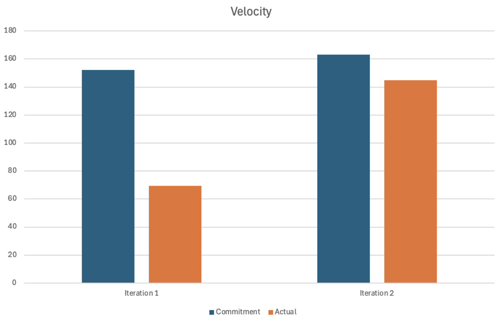

# Retrospective

In our recent discussions about the project, we identified several areas that need improvement to enhance our overall efficiency and effectiveness. One significant issue is our communication frequency. We have noticed our communication tends to be infrequent up until one or two days prior to the iteration due date, and we are not checking in as much as we should in order to make sure we are on track with our progress. This lack of regular check-ins means we're not consistently tracking our progress or addressing issues in a timely manner. Consequently, this leads to a last-minute rush, where we end up working intensively for the final two days to complete tasks, resulting in unnecessary stress and a less efficient workflow.

Another critical area for improvement we have discussed is the setting of deadlines. Currently, we haven't been establishing specific deadlines for individual developer tasks once we start them. This lack of deadlines contributes to the rushed state we find ourselves in as the iteration deadline approaches. By not having clear deadlines, we are not only putting ourselves under pressure but also compromising the quality and timeliness of our work.

A third area we need to focus on is enhancing our unit test coverage. From our performance in iterations 1 and 2, it's clear that most of our marks were lost due to the unit test coverage being below 80%. Improving this aspect will be crucial in ensuring that our code is more robust, reliable, and meets the necessary quality standards.

To address the communication challenges we’ve faced and improve our team’s coordination in this next iteration, we plan to hold a short team meeting after each class and once over the weekend. During these meetings, each team member will provide an update on their current tasks, what they’ve accomplished, and what is left to do. This will help ensure that everyone is on the same page and ensure we have the time to address any issues or adjustments needed. We will evaluate the success of this communication improvement at the end of the iteration by assessing whether our check-ins have led to smoother progress and fewer last-minute rushes.

Regarding deadlines, we will have a more structured approach by setting specific deadlines for each developer task in GitLab. We will measure the success of this approach by monitoring whether we meet at least 50% of our deadlines. This will help us with staying on track with our planning and a more efficient workflow.

Lastly, to address unit test coverage, we will need to refactor our existing code to enhance test coverage, where tests were previously missing. Our success will be measured by achieving a minimum of 80% test coverage for our existing codebase. Additionally, as we develop and add new features, we will ensure our tests maintain at least 80% unit test coverage overall.

This velocity graph shows us that we overestimated what we could produce in the first iteration. We had committed to producing three features but only delivered two. We adjusted our estimates for iteration 2 and this velocity graph shows there was improvement.