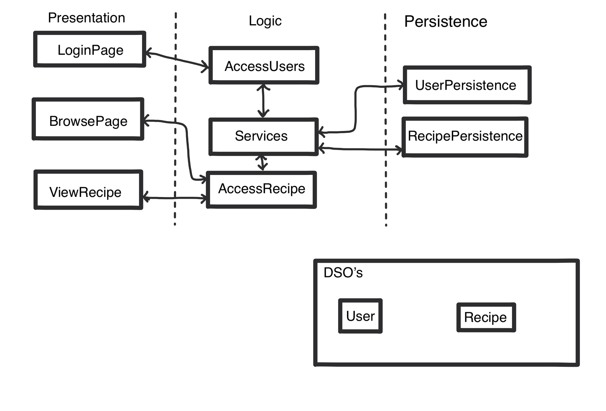

As shown in the diagram, our architecture is a 3-tiered architecture consisting of a Persistence layer, a Logic layer and a Presentation Layer.

# DSOs
We have 2 Objects that get passed between layers, stored in the package: **recipebook.objects**

* **recipebook.objects.Recipe**
The first of which is the Recipe object, that stores all information related to a single recipe.

* **recipebook.objects.User**
The second is the User object, that stores all information related to a single user.

# Persistence Layer
In the persistence layer we have 2 interfaces that handle the storage of the objects, stored in the package: **recipebook.persistence**

* **recipebook.persistence.RecipePersistence:**
This controls the storage of everything related to the recipes. This also includes the storage of tags that the recipes are categorized by. In iteration 2 this will include more functions related to editing and deleting recipes, but as we did not get to the feature that requires those functions we have left them out for this release.

* **recipebook.persistence.UserPersistence:**
This controls the storage of everything related to the users. This includes the ability to add users to the list as well.

# Logic Layer
In the logic layer we have 2 interfaces that handle the logic to do actions, stored in the package: **recipebook.business**

* **recipebook.business.AccessUserInterface:**
This controls the logic required to access the user's account (logging in), and to update the account.

* **recipebook.business.AccessRecipeInterface:**
This handles the logic when accessing Recipes. Currently the logic done in the implementation is minimal but once the ability to create new recipes and update recipes are added in Iteration 2 the amount of logic needed will increase significantly.

**recipebook.application.Services:**
In the logic layer there is also a class called Servicing that ensures there is only 1 synchronized instance persistence classes to ensure there arent multiple copies of the database created. This class is used to connect the logic layer to the presentation layer.

# Presentation Layer
In the presentation layer we have 3 pages that display the state of the user, all classes related to these pages are stored in the package: **recipebook.presentation**

## Page 1: Login Page

* **CreateAccountActivity:**
manages the UI for when the user is creating a new account.

* **UpdateAccountActivity:**
manages the UI for when the user is updating their account info.

* **LogInActivity:**
manages the UI for when the user is trying to login.

## Page 2: View Recipe
This shows the full details of a Recipe.

* **ViewRecipeActivity:**
manages the UI for when the user is viewing the details of a single recipe.

## Page 3: Browse Recipes Page.
This shows all of the recipes grouped by their respective categories.

* **BrowseCategoryAdapter:**
displays all recipes that are associated with a tag

* **BrowseRecipeAdapter:**
displays all recipes

* **BrowseRecipeActivity:**
controls the display of the page and the components made in BrowseRecipeAdapter and BrowseCategoryAdapter
