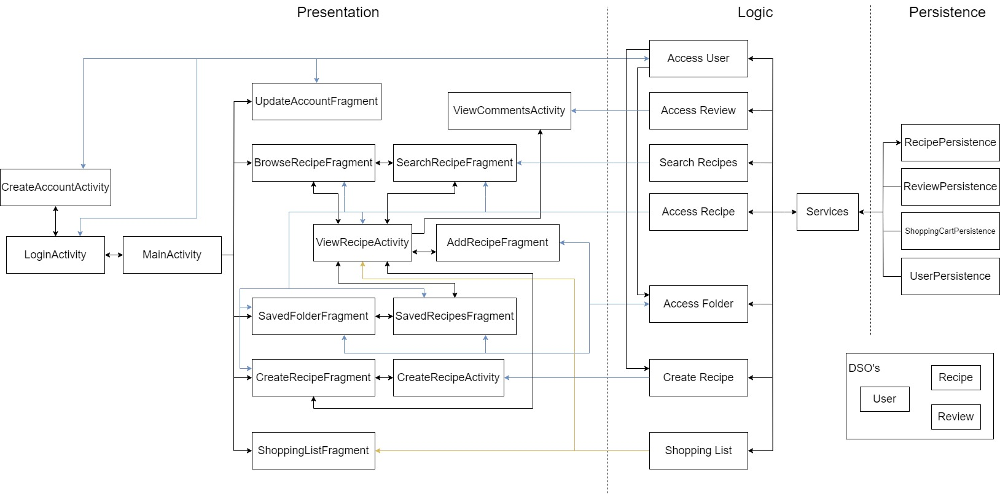

As shown in the diagram, our architecture is a 3-tiered architecture consisting of a Persistence layer, a Logic layer and a Presentation Layer.

# DSOs
We have 3 Objects that get passed between layers, stored in the package: recipebook.objects

* **recipebook.objects.Recipe**
The first of which is the Recipe object, that stores all information related to a single recipe.

* **recipebook.objects.User**
The second is the User object, that stores all information related to a single user.

* **recipebook.objects.Review**
This is the Review Object that stores information related to reviews and ratings left on a recipe

# Persistence Layer
In the persistence layer, we now have 4 interfaces  that handle the storage of the objects, stored in the package: **recipebook.persistence**

* **recipebook.persistence.RecipePersistence**:
This controls the storage of everything related to the recipes. This also includes the storage and retrieval of tags and that the recipes are categorized by. It also includes functions related to inserting created recipes and searching for recipes with names that matches search term.

* **recipebook.persistence.UserPersistence**:
This controls the storage of everything related to the users. This includes the ability to add users, login and logout.

* **recipebook.persistence.ReviewPersistence**: This controls the storage of reviews and ratings for the recipes

* **recipebook.persistence.ShoppingCartPersistence** : This controls the storage of recipes and their ingredients added to the user's shopping cart.

# Logic Layer
In the logic layer we have 7 interfaces that handle the logic to do actions, stored in the package: recipebook.business

* **recipebook.business.AccessUserInterface**:
This controls the logic required to access the user's account (logging in), and to update the account.

* **recipebook.business.AccessRecipeInterface**:
This handles the logic when accessing Recipes. 

* **recipebook.business.AccessFolderInterface**:
This handles the logic for creating folders and adding recipes to folders.

* **recipebook.business.CreateRecipeInterface**:
This handles the logic for creating a recipe.

* **recipebook.business.SearchRecipeInterface**:
This handles the logic required to display search results and allow filtering results by tags.

* **recipebook.business.AccessReviewInterface**:
This handles the logic required to add reviews and ratings for a recipe.

* **recipebook.business.ShoppingListInterface**:
This handles the logic required to add recipes to or remove recipes from a users shopping cart.

**recipebook.application.Services**:
In the logic layer there is also a class called Services that ensures there is only 1 synchronized instance persistence classes to ensure there arent multiple copies of the database created. This class is used to connect the logic layer to the presentation layer.

# Presentation Layer
In the presentation layer there are many different pages that allow the users to perform various actions: recipebook.presentation

# Page 1:Login page
* **CreateAccountActivity**:
manages the UI for when the user is creating a new account.

* **UpdateAccountFragment**:
manages the UI for when the user is updating their account info.

* **LogInActivity**:
manages the UI for when the user is trying to login.

# Page 2: View Recipe
This view shows the full details of a Recipe and allows user to add recipe to their saved folders.

* **ViewRecipeActivity**:
manages the UI for when the user is viewing the details of a single recipe.

* **AddRecipeAdapter**:
controls the display of the list of folders that a recipe can be added to.

* **AddRecipeFragment**:
displays the list of folders that a recipe can be added to.

# Page 3 : Browse Recipes Page
This shows all of the recipes grouped by their respective categories.

* **BrowseCategoryAdapter**:
controls the display of recipe groups associated by tags.

* **BrowseRecipeAdapter**:
controls the display of all recipes that are associated with a tag.

* **BrowseRecipeFragment**:
display the view components made in BrowseRecipeAdapter and BrowseCategoryAdapter.

# Page 4: Search Results Page
* **SearchResultAdapter**:
controls the display of search results

* **SearchResultFragment**:
display and control search bar, search results and allows user to filter results by tags.

# Page 5: Saved Recipes Page
* **SavedFolderFragment**:
displays all the folders associated with the user.

* **SavedFolderAdapter**:
controls the display of the folders.

* **SavedRecipesFragment**:
displays all the saved recipes from a folder.

* **SavedRecipesAdapter**:
controls the display of the recipes in a folder.

# Page 6: Create Recipe Page
* **CreateRecipeFragment**:
displays the recipes that a user has already created.

* **CreateRecipeActivity**:
page where user can enter in recipe details to create a recipe.

# Page 7: Review Recipe Page
* **ReviewsAdapter**: controls the display of the reviews a user left on a recipe

* **ViewCommentsActivity**: manages the UI for when a user wants to leave a rating and comment/review on a recipe

# Page 8: Shopping List Page
* **ShoppingListAdapter**: controls the display of the recipes in a user's shopping list

* **ShoppingListFragment**: displays the recipes in a user's shopping list

* **ShoppingListIngredientAdapter**: controls the display of the ingredients of a recipe in a user's shopping list

# Main Page
* **MainActivity** :  
container that allows the user to navigate between account management, saved recipes, search&browse, and created recipes page.
